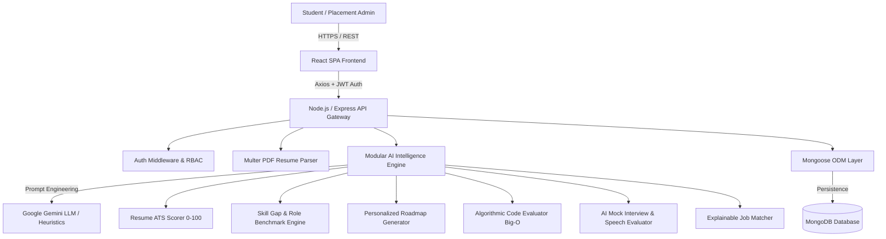

# 🚀 CareerPilot AI — AI-Powered Career Development & Placement Platform

> **B.Tech Final-Year Capstone Project — Computer Science & Engineering**  
> *A production-grade, full-stack MERN & AI-driven ecosystem empowering college students to analyze resumes, bridge skill gaps, practice algorithmic coding, conquer AI mock interviews, and secure top placement opportunities.*

---

## 📌 1. Project Overview & Problem Statement

### The Placement Readiness Challenge
College students preparing for campus placements and off-campus drives face significant hurdles:
1. **The Resume Black Hole**: Resumes are rejected by Applicant Tracking Systems (ATS) due to missing domain keywords, poor formatting, or lack of quantifiable metrics.
2. **Ambiguous Skill Gaps**: Students often don't know what specific technical competencies they lack compared to industry hiring standards for their target job roles.
3. **Fragmented Learning**: Learning resources are scattered, lacking a personalized, structured phase-by-phase roadmap.
4. **Interview Anxiety & Lack of Mentorship**: Access to realistic, project-aware mock interviews with immediate constructive technical feedback is rare.
5. **Black-Box Job Matching**: Traditional job boards show raw match percentages without explaining *why* a candidate matches or *what to learn* to qualify.

### CareerPilot AI Solution
**CareerPilot AI** unifies the entire student placement journey into an intelligent, data-driven platform:
```
Create Account → Build Profile → Upload Resume → AI ATS Analysis → Skill Gap Analysis 
      → Personalized Roadmap → Practice Coding + AI Big-O Feedback → AI Mock Interview 
      → Explainable Job Matching → Progress Tracking & Admin Analytics
```

---

## 🛠️ 2. Technology Stack

### Frontend (Client SPA)
- **Framework**: React.js (v18) with Vite
- **Routing**: React Router DOM (v6)
- **Styling**: Vanilla CSS Design System with CSS Custom Properties, Glassmorphism, and responsive Dark/Light themes (*Zero Tailwind CSS per specification*)
- **Data Visualizations**: Recharts (Radar charts, Area graphs, Bar charts)
- **Icons**: Lucide React
- **HTTP Client**: Axios with JWT Interceptors & auto-refresh
- **Celebrations**: Canvas-Confetti

### Backend (REST API Server)
- **Runtime**: Node.js & Express.js
- **Database**: MongoDB & Mongoose ORM (with resilient in-memory fallback)
- **Authentication**: JWT (JSON Web Tokens) with `bcryptjs` password hashing & Role-Based Access Control (`student`, `admin`)
- **Document Processing**: Multer + `pdf-parse` for binary PDF resume text extraction
- **Process Orchestration**: Concurrently for running full stack simultaneously

### AI Integration
- **LLM Engine**: Google Gemini API (`@google/generative-ai`)
- **Modular AI Architecture**: Pluggable AI service modules for Resume Analysis, Skill Gap Comparison, Roadmap Generation, Coding Evaluation, and Interview Simulation with intelligent NLP heuristic fallbacks.

---

## 🏛️ 3. System Architecture & Workflows



---

## 📊 4. Mathematical Scoring Logic

### Overall Career Readiness Formula
The platform computes a transparent, weighted Career Readiness percentage:

$$\text{Career Readiness} = (R \times 0.25) + (S \times 0.25) + (C \times 0.20) + (I \times 0.20) + (P \times 0.10)$$

Where:
- $R$ = **Resume ATS Score** (0–100, evaluated across Skills, Projects, Education, Experience, Achievements, Formatting, and Role Relevance)
- $S$ = **Role Skill Match Score** (0–100, percentage of target role benchmark skills acquired)
- $C$ = **Coding Performance Score** (0–100, problem solving velocity & test case pass rate)
- $I$ = **Mock Interview Rating** (0–100, converted from 10-point scale on technical knowledge, communication, problem solving, and completeness)
- $P$ = **Project Portfolio Score** (0–100, based on live hosted demos and repository links)

---

## 👥 5. User Roles & Capabilities

### 🎓 Student Role
- **Profile Management**: Academics, CGPA, multi-category skills matrix, projects with GitHub/Live links, certifications.
- **AI Resume Analyzer**: Instant ATS score, 7-category breakdown, actionable feedback, and missing keywords.
- **Target Career & Skill Gap**: Compare against 9+ domain benchmarks (MERN Full Stack, AI/ML, DevOps, Java, Python, UI/UX, etc.).
- **Personalized Roadmap**: Multi-phase study pathway with status tracking and curated resources.
- **Coding Practice Hub**: 12 DSA categories with in-browser editor and AI Big-O feedback ($O(N)$, space complexity).
- **Timed Assessments**: Countdown timer, question navigation, topic-wise strengths/weaknesses.
- **AI Mock Interviews**: Voice dictation / text input, project-specific dynamic questions, real-time feedback, and STAR coaching.
- **Explainable Job Matching**: "Why you match" breakdown and "Skills to learn" suggestions.
- **Progress Tracking & In-App Notifications**: Longitudinal trajectory charts and job alerts.

### 🛡️ Placement Admin Role
- **Executive Analytics Dashboard**: Enrolled students count, active jobs, completed assessments, campus score averages.
- **Cohort Directory**: Filter students by target role, college, readiness score; activate/deactivate accounts.
- **Placement Job Management**: Create, edit, and delete job postings with required skill benchmarks.
- **Coding Question Management**: Add new algorithmic challenges with custom test cases.
- **Curated Learning Resources**: Manage official docs, courses, and cheat sheets.

---

## 🔑 6. Demo Credentials (Instant 1-Click Access)

| Role | Email | Password | Features Highlighted |
| :--- | :--- | :--- | :--- |
| **Demo Student** | `student.demo@careerpilot.ai` | `Password@123` | Full MERN profile, 82% ATS Resume, 78% Readiness, Active Roadmap |
| **Demo Admin** | `admin@careerpilot.ai` | `AdminPassword@123` | Directorate Analytics, Student Directory, Job Posting CRUD |

*(Or click the 1-Click Demo Login buttons directly on the landing/auth pages for instant access.)*

---

## ⚡ 7. Quick Installation & Running Locally

### Prerequisites
- Node.js (v18+ recommended)
- npm (v9+)
- MongoDB (optional local instance or MongoDB Atlas URI)

### Step 1: Clone & Install Dependencies
```bash
# In the root directory (e:/Demo/CareerPilot)
npm run install:all
```

### Step 2: Configure Environment Variables
Copy `.env.example` in both root and `server/`:
```bash
# server/.env
PORT=5000
MONGO_URI=mongodb://127.0.0.1:27017/careerpilot
JWT_SECRET=careerpilot_super_secret_jwt_key_2026_final_year_project
JWT_EXPIRE=30d
CLIENT_URL=http://localhost:5173

# Optional: Add your Gemini API key for live LLM responses
GEMINI_API_KEY=
```

### Step 3: Seed Database with Realistic Data
```bash
npm run seed
```

### Step 4: Start Full-Stack Application
```bash
npm run dev
```
- **Frontend SPA**: `http://localhost:5173`
- **Backend API**: `http://localhost:5000`
- **API Health Check**: `http://localhost:5000/api/health`

---

## 📡 8. REST API Endpoints Overview

| Module | Method | Endpoint | Description | Access |
| :--- | :--- | :--- | :--- | :--- |
| **Auth** | `POST` | `/api/auth/register` | Register student account | Public |
| **Auth** | `POST` | `/api/auth/login` | Login user & issue JWT | Public |
| **Auth** | `POST` | `/api/auth/demo-student` | 1-Click Demo Student login | Public |
| **Auth** | `POST` | `/api/auth/demo-admin` | 1-Click Demo Admin login | Public |
| **Profile** | `GET, PUT` | `/api/profile` | Get / update student profile | Private |
| **Resume** | `POST` | `/api/resume/upload` | Upload PDF & run ATS analysis | Private |
| **Resume** | `GET` | `/api/resume/current` | Get active resume & score | Private |
| **Skills** | `GET` | `/api/skills/gap-analysis` | Compare skills vs role benchmark | Private |
| **Roadmap** | `GET, POST` | `/api/roadmap` | Get / generate AI study roadmap | Private |
| **Coding** | `GET` | `/api/coding/questions` | Filter practice questions | Private |
| **Coding** | `POST` | `/api/coding/questions/:id/submit` | Submit code & receive AI evaluation | Private |
| **Assessment** | `POST` | `/api/assessments/start` | Start timed coding test | Private |
| **Interview** | `POST` | `/api/interviews/start` | Start AI mock interview | Private |
| **Interview** | `POST` | `/api/interviews/:id/answer` | Submit voice/text answer for AI score | Private |
| **Jobs** | `GET` | `/api/jobs` | Get explainable job matches | Private |
| **Admin** | `GET` | `/api/admin/analytics` | Platform-wide placement analytics | Admin Only |

---

## 🎓 9. Final-Year Project Viva-Voce Highlights

1. **Full-Stack Engineering Rigor**: Complete separation of concerns, JWT authorization middleware, centralized error handling, Mongoose ODM schemas, and responsive UI.
2. **True AI Utility**: Google Gemini integration paired with robust algorithmic scoring engines (ATS document parser, Big-O code complexity evaluator, STAR behavioral scoring).
3. **Explainable AI (XAI)**: Translucent, justified recommendations (why a job matches, exact missing keywords, and algorithmic optimization tips).
4. **Resilient Production Architecture**: Zero-setup fallback support allowing smooth evaluation even in environments without an active MongoDB daemon or internet connection.
